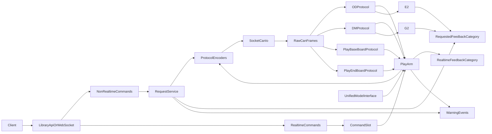

# AIRBOT Play Rust Crate Component Design

## Purpose
This document defines a simpler component design for the Rust crate that implements the AIRBOT Play CAN driver. It follows the updated user story in `design/user-story.md`.

The crate must provide:
- fully asynchronous SocketCAN I/O;
- a clear separation between frame protocol logic and actual CAN send/receive;
- a fixed-rate control loop for realtime writes;
- motor-level parsing for `OD` and `DM`;
- board-level parsing for AIRBOT Play base-board and end-board communication;
- one built-in kinematics and dynamics layer with a unified backend interface for `FK / IK / FD / ID`;
- bundled URDF assets;
- one semantics model shared by direct library use and by the WebSocket executable.

## Design Rules
- Keep frame protocol and actual CAN I/O separate.
- Keep CAN parsing at the motor level.
- Keep requested responses separate from realtime responses.
- Keep non-realtime commands separate from realtime commands.
- Keep the arm state machine small: `disabled`, `free drive`, `command following`.
- Keep the end-effector state machine small: `disabled`, `enabled`.
- Keep the transport layer thin. It adapts messages, but it does not redefine robot semantics.
- Support library use first. The WebSocket server is a wrapper over the library API.

## Chosen Implementation Stack
The current implementation choices are:

| Area | Choice |
| --- | --- |
| async runtime | `tokio` |
| raw CAN access | `socketcan` |
| async CAN integration | `tokio::io::unix::AsyncFd` wrapped around `socketcan` sockets |
| WebSocket transport | `tokio-tungstenite` |
| WebSocket payload encoding | `serde` + `serde_json` |
| initial model backend | Pinocchio via `cxx` |
| C++ FFI bridge | `cxx` |
| bundled URDF embedding | `include_bytes!` |
| temporary URDF materialization for Pinocchio | `tempfile` |
| warning event fanout | `tokio::sync::broadcast` |
| logging | `tracing` |
| error types | `thiserror` |

Notes:
- `socketcan` is the chosen underlying CAN crate. The crate owns CAN socket creation and frame types.
- `tokio` is the chosen async runtime for request handling, WebSocket serving, and CAN readiness integration.
- The fixed-rate arm control loop may still use a dedicated thread plus `tokio` coordination, but the overall async runtime choice is fixed to `tokio`.
- The protocol layer stays pure: it parses and generates frames but does not own CAN sockets or async tasks.

## Main Components

| Component | Responsibility |
| --- | --- |
| `can::socketcan_io` | Own actual SocketCAN sockets, async receive readiness, and raw frame writes |
| `protocol::motor::od` | Parse and generate OD motor frames; no socket ownership |
| `protocol::motor::dm` | Parse and generate DM motor frames; no socket ownership |
| `protocol::board::play_base` | Parse and generate play base-board frames and config requests |
| `protocol::board::play_end` | Parse and generate play end-board frames and config requests |
| `protocol::board::gpio` | Parse board button and LED-related frames where applicable |
| `arm::play` | Compose 6 arm motors, manage the 3 arm states, publish arm feedback |
| `arm::command_slot` | Hold the latest realtime target for command following |
| `eef::g2` | Single-motor G2 end-effector wrapper with transform helpers |
| `eef::e2` | Single-motor E2 end-effector wrapper with transform helpers |
| `request_service` | Execute non-realtime queries such as params, SN, and ping |
| `model` | Unified `FK / IK / FD / ID` interface, backend selection, bundled URDF lookup, and initial Pinocchio backend |
| `warning_bus` | Publish non-fatal warning events to library and WebSocket subscribers |
| `probe` | Required executable and library helper for discovering robot instances on candidate CAN interfaces |
| `websocket` | Standalone executable adapter over the library |
| `diag` | Required semantic `candump`-style diagnostic executable used to validate protocol parsers |

## High-Level Data Flow


## Protocol Layer vs CAN I/O Layer

### Protocol layer
The protocol layer is pure frame logic.

It should:
- decode raw CAN frames into typed motor or board payloads;
- encode typed commands and queries into raw CAN frames;
- keep parser-local assembly state for multi-frame parameter responses;
- keep parser-local encode settings such as protocol limits when needed.

It should not:
- open or own CAN sockets;
- manage async readiness;
- spawn control tasks;
- manage arm or EEF lifecycle.

### CAN I/O layer
The CAN I/O layer is transport only.

It should:
- open and configure SocketCAN sockets;
- receive raw CAN frames asynchronously;
- send raw CAN frames produced by the protocol layer;
- timestamp and forward frames to higher layers.

It should not:
- know OD, DM, base-board, or end-board semantics beyond frame delivery;
- implement arm state transitions;
- contain protocol-specific parsing logic.

## Semantic Categories

### Feedback categories
The crate exposes two feedback categories.

These categories are semantic buckets, not required Rust type names. The implementation may use several structs, enums, or streams inside each category. There is no requirement to put all feedback into one large response struct.

| Category | Typical contents | Frequency |
| --- | --- | --- |
| realtime feedback | arm joint state, motor motion state, timestamps, validity | high frequency |
| requested feedback | serial number replies, motor parameter replies, board parameter replies, ping replies, mounted EEF metadata, gravity coefficient query replies | on request |

Recommended concrete Rust payloads include:
- `ArmJointFeedback`
- `MotorRealtimeFeedback`
- `BoardParamReply`
- `ParamReply`
- `SerialNumberReply`
- `PingReply`
- `MountedEefReply`

### Command categories
The crate exposes two command categories:

| Category | Purpose |
| --- | --- |
| non-realtime command | state change, param query, ping |
| realtime command | joint-space target or task-space target |

### Access Modes

| Mode | Allowed actions |
| --- | --- |
| `readonly` | receive realtime responses, issue read-only requested queries |
| `control` | everything in `readonly`, plus state changes and realtime control |

Readonly must block:
- arm state changes;
- realtime arm commands;
- any write-style parameter operations if they are added later.

Readonly must still be able to subscribe to warning events.

## Warning Events
Warning events are separate from feedback categories. They are non-fatal events used to report degraded timing or service quality without changing the arm state machine.

Typical warning kinds:
- `RequestedReplyTimeout`
- `RealtimeFeedbackTimeout`
- `ControlRateLow`
- `ControlTickOverrun`
- `StaleCommandReplay`

Every warning event should include:
- timestamp;
- interface or robot identifier;
- warning kind;
- human-readable message;
- machine-readable details such as observed rate, timeout value, or age.

Warnings are visible to both readonly and control clients.
Warnings do not by themselves imply a fault, but a higher layer may later escalate a persistent warning into a fault if needed.

## Realtime and Requested Response Path

### Realtime path
- SocketCAN I/O receives raw frames asynchronously.
- A frame router dispatches raw frames to the protocol parser that owns the corresponding CAN ID.
- `protocol::motor::od` and `protocol::motor::dm` emit motor state in physical units.
- `arm::play` combines six motor states into one or more arm realtime feedback payloads.
- The public realtime stream is only active when the arm state is `free drive` or `command following`.
- If realtime feedback stops arriving on time while the arm is active, the crate emits a warning event.

### Requested path
- A client sends a non-realtime command.
- `request_service` asks the protocol layer to generate the required raw CAN query frames.
- CAN I/O sends those raw frames.
- Responses are parsed by the motor and board protocol parsers.
- The result is returned as one or more requested-feedback payloads.
- Requested responses remain available while the arm state is `disabled`.
- If a requested reply is not obtained within the configured timeout, the crate emits a warning event.

## Motor Layer

### Why the motor layer is first
The detailed CAN frame layouts already exist in the legacy parser implementations. The new crate should preserve that design rather than pushing parsing up into the arm layer.

### Supported motors
- `OD`
- `DM`

Out of scope:
- `ODM`

### Motor parser responsibilities
Each motor parser must:
- own the CAN frame decode rules for that motor family;
- own the encode rules for motion commands and parameter commands;
- return motor state in physical units;
- return requested parameter values in typed form;
- be reusable by the diagnostic tool;
- never own actual CAN send or receive.

## Board Layer

### Why the board layer exists
Communication to the AIRBOT Play arm is not identical to communication to its six motors.

Some device-level metadata and configuration live on dedicated boards rather than on the motor channels. The crate therefore needs explicit board parsers in addition to motor parsers.

### Board roles
The current AIRBOT Play design should account for:
- a play base board;
- a play end board.

The legacy parser layout shows these as separate parser families and separate board IDs.

### Board parser responsibilities
Board parsers must handle requested-response and configuration traffic such as:
- board identifiers;
- hardware and firmware versions;
- `pcba_sn`;
- `product_sn`;
- `eef_type`;
- `manufacture_flag`;
- gravity compensation parameters;
- zero-position and other board-resident metadata;
- board button or LED related parameters where applicable.

Board parsers do not replace motor parsers. They cover the part of the arm protocol that is board-resident rather than motor-resident.
They also must not own actual CAN send or receive.

## Arm Component

### Physical composition
The AIRBOT Play arm session is composed of:

- six joint motors;
- one play base-board communication path;
- one play end-board communication path.

The six arm motors are fixed to:

```text
joint1 = OD
joint2 = OD
joint3 = OD
joint4 = DM
joint5 = DM
joint6 = DM
```

### Arm state machine
The arm has exactly these states:
- `disabled`
- `free drive`
- `command following`

### Disabled
- Initial state.
- Realtime motion commands are rejected.
- Public realtime arm feedback is not emitted.
- Requested responses such as serial number, board params, motor params, and ping remain available.

### Free drive
The control loop performs gravity compensation only.

Per tick:
1. Read the latest arm joint positions.
2. Select the mounted end-effector type from requested metadata.
3. Select the corresponding bundled URDF.
4. Compute inverse dynamics with zero velocity and zero acceleration.
5. Multiply the result by the AIRBOT gravity coefficient vector.
6. Send MIT command with zero target position, zero target velocity, zero MIT gains, and feedforward torque equal to the scaled gravity torque.

The arm does not control the end effector here. It only uses mounted end-effector type to choose the correct model.
Mounted end-effector type is obtained through board-level metadata rather than assumed from the motor layout alone.
If the fixed-rate loop repeatedly misses its target period, the arm component emits warning events.

### Command following
The arm always uses MIT mode in this state.

Per tick:
1. Read the latest command slot.
2. If the slot contains a task-space target, convert it to a joint target first.
3. Compute gravity compensation from the current joint state.
4. Use the current joint target as `target_pos`.
5. Use zero vector as `target_vel`.
6. Send MIT command using:

```text
torque = kp(current_pos - target_pos)
       + kd(current_vel - 0)
       + ff_torque
```

Where `ff_torque` is the gravity compensation torque.

If the effective control loop rate drops below the expected 250 Hz target for a sustained window, the arm component emits a `ControlRateLow` warning event with both target and observed rate.

Current default gains carried forward from the legacy driver:

```text
kp = [200, 200, 200, 50, 50, 50]
kd = [3, 3, 3, 1, 1, 1]
```

### Command slot
The command slot is deliberately simple:
- it stores only the latest accepted realtime command;
- newer commands replace older ones;
- the control loop reuses the slot contents every tick;
- this is what allows low-rate clients to control a higher-rate loop.

To keep the control tick simple, task-space commands should be normalized into joint targets before or at slot update time whenever possible.
If the slot contents become too old and are still being replayed, the crate emits a `StaleCommandReplay` warning event.

## Model Layer

### What "KDL included" means in this crate
The crate includes its own built-in kinematics and dynamics layer. This layer must expose one unified backend-agnostic interface. Pinocchio is only the initial backend.

### Unified interface
The public model API should not expose Pinocchio-specific types. Instead, it should expose one trait or interface that covers:
- `FK` for forward kinematics;
- `IK` for inverse kinematics;
- `FD` for forward dynamics;
- `ID` for inverse dynamics.

A reasonable Rust shape is:

```rust
pub trait KinematicsDynamicsBackend {
    fn forward_kinematics(&self, joints: &[f64]) -> Result<Pose, ModelError>;
    fn inverse_kinematics(&self, target: &Pose, seed: Option<&[f64]>) -> Result<Vec<f64>, ModelError>;
    fn forward_dynamics(&self, joints: &[f64], vel: &[f64], torque: &[f64]) -> Result<Vec<f64>, ModelError>;
    fn inverse_dynamics(&self, joints: &[f64], vel: &[f64], acc: &[f64]) -> Result<Vec<f64>, ModelError>;
}
```

The rest of the crate should depend on this unified interface rather than on Pinocchio directly.

### Backend selection
The model layer should have:
- a backend trait or interface;
- a small registry or factory that selects a backend implementation;
- one initial backend implementation: Pinocchio.

This allows future additions such as other kinematics or dynamics engines without changing the arm, EEF, request, or transport layers.

### Responsibilities
The model layer provides:
- forward kinematics;
- inverse kinematics;
- forward dynamics;
- inverse dynamics;
- URDF selection by mounted end-effector type.

The model layer also hides backend-specific details and exposes one consistent result shape to the rest of the crate.

### Pinocchio FFI
The Rust crate should call a small C++ bridge rather than bind the entire Pinocchio API. This bridge implements one backend for the unified model interface.

Expected bridge surface:
- `load_model`
- `forward_kinematics`
- `inverse_kinematics`
- `inverse_dynamics`

The Rust side owns the unified public API. The C++ side is only a narrow computation backend for the Pinocchio implementation.

### URDF assets
URDFs must be bundled inside the crate.

Expected assets:
- `play.urdf`
- `play_e2.urdf`
- `play_g2.urdf`

Selection rule:
- mounted `none` -> `play.urdf`
- mounted `E2` -> `play_e2.urdf`
- mounted `G2` -> `play_g2.urdf`

The library user must not need to provide a path for these built-in URDFs.

### Gravity coefficients
Gravity compensation depends on the mounted end-effector type. The crate should query coefficients from hardware when available and otherwise fall back to known defaults carried from the legacy implementation.

Current known defaults:

```text
none = [0.6, 0.6, 0.6, 1.6, 1.248, 1.5]
E2   = [0.6, 0.6, 0.6, 1.338, 1.236, 0.893]
G2   = [0.6, 0.6, 0.6, 1.303, 1.181, 1.5]
```

## End-Effector Components

### State machine
Each end effector has only:
- `disabled`
- `enabled`

### Ownership
- The arm does not own end-effector control.
- The arm does not publish end-effector state as part of its own state machine.
- The arm only reads mounted end-effector type for model selection.

### G2
G2 is one `DM` motor wrapped as a parallel gripper.

The component must reuse the legacy transform between motor-space and parallel-space with:
- `L1 = 0.022`
- `L2 = 0.036`
- `L3 = 0.01722`
- `theta0 = 2.3190538837099055`

This includes:
- motor position to parallel opening;
- motor velocity to parallel velocity;
- motor torque to parallel force equivalent;
- inverse mapping for outgoing control targets.

### E2
E2 is one `OD` motor wrapped as a simpler 1-DOF device.

The current transform is:

```text
eef_pos = -motor_pos * 0.018
eef_vel = motor_vel
eef_eff = 0
```

The same helper module should also provide the inverse transform used by any outgoing E2 command path.

## Request Service
This component handles all non-realtime commands:
- query serial number;
- query board and product parameters;
- query mounted end-effector type;
- query gravity coefficients;
- query base-board and end-board configuration values;
- ping for liveness;
- request arm state changes.

This service remains active while the arm is disabled.
It is also responsible for timing out slow requests and emitting warning events for late or missing replies.

## Probe Executable
The probe executable is required for finding robot instances.

It should:
- scan candidate CAN interfaces;
- send the required probe traffic for AIRBOT identification;
- use the same request and protocol layers as the library;
- collect enough metadata to distinguish discovered instances;
- print or emit a machine-readable summary of detected instances.

The probe executable is not optional helper tooling. It is the required way to discover available instances from the command line and to validate that probing works end to end.

## WebSocket Adapter
The crate must support direct library use and also a standalone WebSocket process.

The WebSocket adapter should:
- expose the same feedback categories and command categories as the library API;
- expose the same warning events as the library API;
- serialize concrete payload structs without inventing new robot semantics;
- enforce readonly versus control permissions;
- avoid inventing a different state machine.

Current scope:
- implement WebSocket now;
- keep DDS and iceoryx2 as future adapters over the same semantics.

## Diagnostic Tool
The crate must provide a diagnostic executable that uses the same parser modules as the library.

It should:
- listen on a CAN interface;
- behave like `candump` for raw traffic visibility;
- decode OD and DM feedback frames into physical values;
- decode play base-board and play end-board frames into meaningful parameters and board events;
- decode requested response frames such as params and SN;
- decode outgoing control frames back into arm or EEF control operations;
- help compare live traffic with expected MIT and parameter behavior.

This tool is a debug view over the same parser and encoder code, not a separate implementation. It also serves as an early validation target for the protocol parsers and encoders.

## Proposed File Layout
```text
src/
  lib.rs
  types.rs
  can/
    mod.rs
    socketcan_io.rs
  request_service.rs
  warnings.rs
  protocol/
    mod.rs
    board/
      mod.rs
      play_base.rs
      play_end.rs
      gpio.rs
    motor/
      mod.rs
      od.rs
      dm.rs
  arm/
    mod.rs
    play.rs
    command_slot.rs
  eef/
    mod.rs
    e2.rs
    g2.rs
  model/
    mod.rs
    backend.rs
    registry.rs
    urdf.rs
    pinocchio.rs
  transport/
    mod.rs
    websocket.rs
  probe/
    mod.rs
    discover.rs
  diag/
    mod.rs
    decode.rs
bin/
  airbot-play-probe.rs
  airbot-play-ws.rs
  airbot-can-diag.rs
ffi/
  pinocchio_shim.hpp
  pinocchio_shim.cpp
assets/
  urdf/
    play.urdf
    play_e2.urdf
    play_g2.urdf
```

## Implementation Order
1. `protocol::motor::od` and `protocol::motor::dm`
2. `protocol::board::*`
3. `can::socketcan_io`
4. diagnostic executable as semantic `candump` and parser-validation tool
5. `request_service`
6. probe executable for instance discovery
7. `model` interface and Pinocchio backend
8. `arm::play` and `arm::command_slot`
9. `eef::e2` and `eef::g2`
10. direct Rust library API
11. WebSocket executable

## Final Decisions
- Frame protocol and actual CAN I/O are separate layers.
- Parsing stays at the motor and board protocol level.
- Board-level communication is modeled explicitly in addition to motor-level communication.
- Only `OD` and `DM` are supported.
- The arm has three states and the end effectors have two.
- The control loop is fixed-rate and reads from a latest-command slot.
- Warning events are emitted for late requested replies, missing realtime feedback, stale command replay, and control-loop timing degradation.
- Command following always uses MIT mode.
- Free drive and command following both depend on the model layer for gravity compensation.
- URDFs are bundled in the crate.
- The model layer exposes a unified `FK / IK / FD / ID` interface.
- Pinocchio is used through a C++ FFI bridge as the initial backend, not the only allowed backend.
- A probe executable is required for instance discovery.
- The diagnostic executable is a semantic `candump` and should be implemented early to validate the protocol parsers.
- WebSocket is the only transport implemented now, but it must not change semantics.
